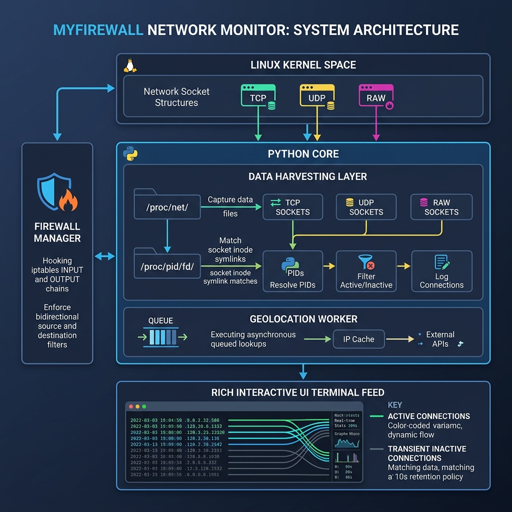

# 🛡️ MyFirewall: Protect Your System from Cyber Attacks

MyFirewall is a simple, visual tool designed to help everyday folks—including **scientists, journalists, government employees, students, and individuals**—monitor their computer's internet activity and block suspicious connections in real time. 

If you are concerned about spyware, unauthorized background connections, or tracking, MyFirewall shows you exactly what apps are talking to the internet, where they are sending data, and lets you block them instantly with a single keypress.

---

## 🎯 Who is this for?

* **📰 Journalists**: Secure your sources. Monitor background connections to ensure sensitive documents or communication apps aren't leaking data to unknown countries.
* **🔬 Scientists & Researchers**: Protect your research data. Keep track of which software tools are accessing external servers and verify they are only connecting to trusted locations.
* **🏛️ Government Employees**: Shield your workspace. Identify rogue software or tools attempting to communicate out of your local network.
* **🎓 Students & Everyday Folks**: Learn and secure. View internet traffic live in a beautiful dashboard and block invasive trackers or apps you don't trust.

---

## ✨ Key Features (Made Simple)

* **🗺️ Real-time Map & Connection Info**: Translates ugly numerical IP addresses into the actual countries they belong to, as well as the name of the app initiating the traffic.
* **🚦 Transient Connection Memory**: Even if an app connects for a split second (a common trick for tracking scripts), MyFirewall keeps it on the screen greyed out for **10 seconds** so you can inspect it.
* **🧱 Live Blocking**: Stop an IP address from sending data to or receiving data from your computer instantly.
* **🙈 Clean Feed (Ignore)**: Hide trusted apps (like your web browser) so you can focus only on the connections you don't recognize.

---

## 🚀 Easy Installation and Setup

### 1. Install Dependencies
Open your terminal and run the following command to download the visual dashboard library:

```bash
pip3 install -r requirements.txt
```

### 2. Run MyFirewall

* **🛡️ Security Mode (Recommended)**: To block connections in real-time, MyFirewall needs system permissions (using `sudo`):
  ```bash
  sudo python3 myfirewall2.py
  ```
* **👁️ Monitor-Only Mode (Safe Mode)**: Runs without root privileges. You can view all connection information, but any blocks will be "mocked" (simulated) and won't affect your active system firewall:
  ```bash
  python3 myfirewall2.py
  ```

---

## ⌨️ How to Use: Interactive Controls

When MyFirewall is running, you will see a list of rows representing apps connected to the internet. Each row has a number (`#`) on the far left.

### 1. Block an App/IP (`B`)
If you see an app or an IP address that looks suspicious (for example, connecting to a country you don't recognize):
1. Press the **`B`** key on your keyboard.
2. A prompt will appear at the bottom: `Block (# or IP):`.
3. Type the **number** of the row (e.g., `1`), or type the **IP address** directly (e.g., `185.190.140.2`).
4. Press **`Enter`**. 
5. The row will turn **red** with a **`[BLKD]`** tag. That remote server can no longer communicate with your system.
6. To **unblock**, press **`B`** again, enter the same number or IP, and press **`Enter`**.

### 2. Hide Trusted Apps/IPs (`I`)
Your dashboard might get crowded with normal traffic (like Chrome or Firefox). To hide them:
1. Press the **`I`** key on your keyboard.
2. A prompt will appear: `Ignore (# or process name):`.
3. Type the row number, the name of the app (e.g., `chrome`), or an IP address you trust.
4. Press **`Enter`**. Those connections will disappear from the live screen.
5. To show them again, type the same name or IP in the ignore prompt again.

### 3. Quit (`Q`)
* Press **`Q`** at any time to exit the dashboard safely.

---

## 🔍 Inspecting Your Blocked & Ignored Rules

All of your settings, blocks, and ignored items are automatically saved in a simple text file inside your home folder. You can open and view this file at any time.

* **Where is it stored?**
  `~/.config/myfirewall/rules.json` (inside your user configuration folder).

* **How to view it?**
  Open your terminal and run:
  ```bash
  python3 -m json.tool ~/.config/myfirewall/rules.json
  ```

---

## 📐 Technical Architecture & Developer Notes

For software developers, engineers, or advanced users:

MyFirewall utilizes ProcFS harvesting and custom `iptables` Netfilter rulesets to verify real-time threat analysis:



1. **Socket Harvester**: Scans `/proc/net/tcp{,6}`, `/proc/net/udp{,6}`, and `/proc/net/raw{,6}` directly in Linux Kernel space at **5Hz (every 0.2s)**.
2. **PID & Process Resolver**: Maps socket inodes by parsing `/proc/<PID>/fd/` symlink associations.
3. **Asynchronous Geolocation**: Resolves external IP ranges through a query queue sequentially using `ip-api.com` without blocking the main UI loops.
4. **Firewall Manager**: Hooks directly into the system's `INPUT` and `OUTPUT` iptables chains, dropping traffic matching `-s` and `-d` selectors.

### Running Unit Tests
```bash
python3 -m unittest test_network_monitor.py test_firewall_manager.py
```

### Codebase Directory Layout
```text
myfirewall-linux/
├── myfirewall2.py            # Main frontend application & dashboard loop
├── myfirewall_core.py        # Shared core threads, caching, and state
├── network_monitor.py        # ProcFS socket parsing core (TCP, UDP, RAW)
├── firewall_manager.py       # IPTables wrapper and rules generator
├── process_resolver.py       # Inode mapping and executable PID correlator
├── test_network_monitor.py   # Unit test coverage for network parses
├── test_firewall_manager.py  # Unit test coverage for firewall commands
├── firewall_architecture.png # Technical system architecture infographic
├── requirements.txt          # Visual dependencies (rich, requests)
├── LICENSE                   # Apache License 2.0
└── debug.log                 # Appendable application trace log
```
